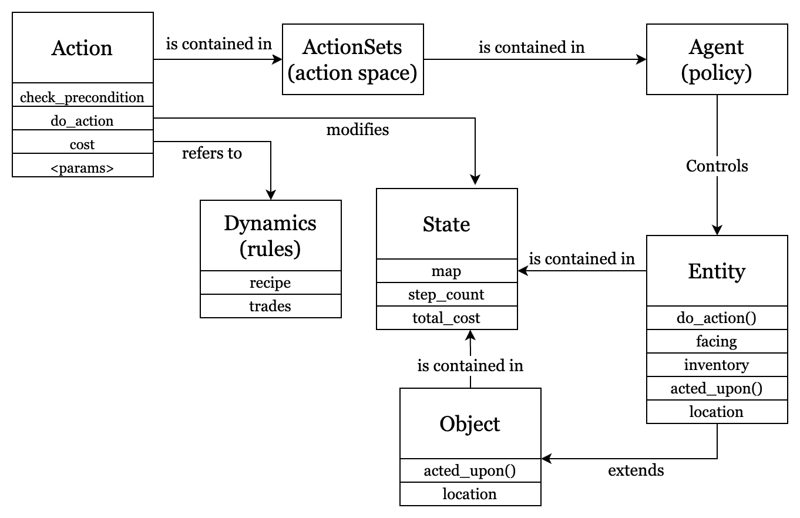

# NovelGridWorlds Version 2
This is a redesigned version of NovelGridWorlds, built on top of OpenAI gym.
The project is tested on Python 3.8, 3.9, and 3.10.

## Building

To build the project, run 
```
python3 -m build
```

## Installation

To install the project directly from source, go to the root folder of the
project, activate your python environment (if applicable), and run

```
pip install .
```

## Running Examples
There are example files in the `examples` folder. Just
make sure you install
the package before you run the examples.

### `polycraft.py`
This file is an example environment for polycraft. 
The file comes with some config files.

`pre_novelty_diarc.json` is a basic environment pre-novelty.
`novelty_jump.json` contains an extra novelty called "jump".

To run the example, run
```
python3 polycraft.py <config_file>
```

We now list some of the example Config files and descriptions:
TODO@!!!!

## Configuration Files
We designed a format of configuration file that is easy to change,
extend, and also allows extra code

<!-- ### `test_render_with_parser`
This file allows you to type commands manually to test the render
function in text and reproduce some errors.

### `test_color_render`
This file allows you to type commands manually to test the render
function in PyGame and reproduce some errors. -->


## Project Structure
The package is structured as follows:



### Action
#### Actions
The `Action` class specifies the preconditions and consequences of an 
action, depending on the type of the entity that's executing the action
and the object that is acted upon.

#### ActionSets
The `ActionSet` class represents a set of actions. Action Sets can be used to 
specify what actions are available to a specific type of entity.

#### Actions in Symbolic vs RL setting
Most default actions are designed to accomodate both symbolic planning
and Reinforcement Learning. 

To run an action with parameters (mostly used in symbolic planning), 
simply pass the parameter to the do_action function.
To initialize multiple actions with pre-defined set of parameters,
pass the parameter when you initialize the object 
(to the `__init__` function). The action will store the
pre-defined parameters and those will be used when `do_action` is called
even if no parameter is provided.

Our configuration file will automatically initialize some actions for you,
which you can see in the [configuration file documentation](docs/config_file.md).


### Objects and Entities
The `Object` class specifies a basic model of an object.
It stores the location of an object in the world and implements basic functions that will react when it is acted upon by an entity.

The `Entity` class is a subclass of the object class. 
In addition to the properties and methods specified above, entities can also execute actions.

Extension to the objects, such as allowing the entity to have an internal inventory or specifying non-default behavior, can be achieved by creating subclasses that inherit from the base object or entity classes.


### State
The `State` class is a low-level map of the world. It allows you 
to place instances of objects on the map at specified locations. It also
allows objects to be randomly placed on empty 
spaces. Direct access to the objects placed in the map is provided through either object type or 
location.

### Agents
Agents are classes that 
1. defines action space and observation space (for RL agents)
2. convert the raw state into state representation
3. implements the policy

The project provides some generic agent that can achieve simple
tasks or serve as an example for more complicated agents:

#### `NOPAgent`
The agent will always pick the nop action if available.

#### `RandomAgent`
The agent will pick a random action (without parameters).

#### `KeyboardAgent`
The agent will print its action set and prompt for the user to 
manually select an action from the list.

#### `SocketAgent`
The process is basically the same as the `KeyboardAgent`, but it sends
the available actions over the socket and expects an action number to 
be send from the remote client.

To test the socket, first run the main `examples/polycraft.py` using
configuration `pre_novelty_socket.json`.
Then, go to `tests/test_socket.py` to directly send text over the socket.

If you want to test your own configuration file with a different socket
number,
make sure you change the `PORT` variable in the `test_socket.py` file to reflect
the port you're using.

#### `DiarcAgent`
The process is basically the same as `SocketAgent` but sends jsons and 
receives diarc commands.

## Rendering
As rendering is entirely dependent on the images you select and how you envision your environment, we leave it up to you. 

For the polycraft example, rendering is available in both PyGame and as simple text in the Terminal.

For a novel object to be rendered correctly on the polycraft gridworld,
currently some extra configuration and code is required. Please see 
[detailed documentation](docs/rendering.md).


## TODO
- wild card action set
- extendable action set
- recipe-based crafting step cost
